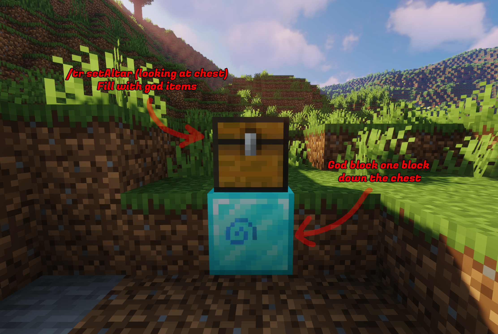

# TownyReligion 
`TownyReligion` is an extension for the popular Towny plugin that allows players and towns to follow specific religions and gods, offering unique gameplay mechanics and additional features. 
## Features - Creation and tracking of specific religions. 
- Assignment of gods with specific potion effects. 
- Potion effects inside the towns borders every 3 minutes.
- Custom commands for managing and following religions. 
- Full integration with Towny. 
- Saving and loading of religion data in text files. 
## Usage
### Commands
- `/tr info`: Display info about your town religion.
- `/tr create GOD_NAME RELIGION_NAME`: As mayor create a new religion.
- `/tr leave`: Leave your town religion.
- `/tr adopt RELIGION_NAME`: Adopt an existing town religion.
- `/tr setAltar`: Set the altar for the town's religion.
- `/tr changeGod GOD_NAME`: Change god of the religion to another see config to add more gods [config.yml](https://github.com/papiricoh/TownyReligion/blob/master/src/main/resources/config.yml).
- `/tr admin TOWN set RELIGION`: Set the religion of a town as OP.
- `/tr gods`: Display a list of gods and effects.

